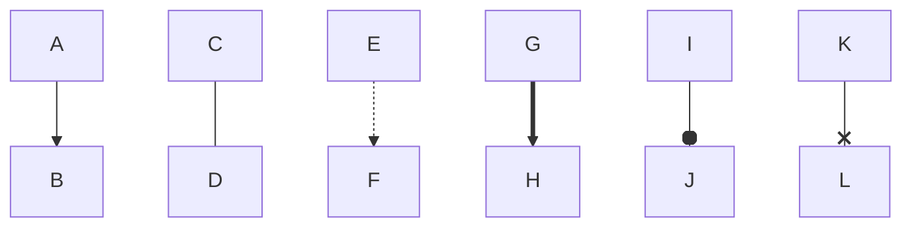

# Шпаргалка по гиту
## Навигация

**pwd** (от англ. print working directory, «показать рабочую папку») — покажи, в какой я папке;

**ls* (от англ. list directory contents, «отобразить содержимое директории») — покажи файлы и папки в текущей папке;

**ls** -a — покажи также скрытые файлы и папки, названия которых начинаются с символа .;

**cd** first-project (от англ. change directory, «сменить директорию») — перейди в папку first-project;

**cd** first-project/html — перейди в папку html, которая находится в папке first-project;

**cd** .. — перейди на уровень выше, в родительскую папку;

**cd** ~ — перейди в домашнюю директорию (/Users/Username);

**cd** / — перейди в корневую директорию.

## Хэш 
Хэш бола-бола, хэш бола-бола-ла

Хэш бола-бола, хэш бола-бола бола-бола бола-ла,

Хэш бола-бола, хэш бола-бола, бола-бола-ла!!!

## Log
инфа про лог))

## Head
HEAD?—?это указатель на текущую ветку, которая, в свою очередь, является указателем на последний коммит, сделанный в этой ветке. Это значит, что HEAD будет родителем следующего созданного коммита. Как правило, самое простое считать HEAD снимком вашего последнего коммита.

## Статусы файлов

Команда git status отображает состояние рабочего каталога и раздела проиндексированных файлов. С ее помощью можно проверить индексацию изменений и увидеть файлы, которые не отслеживаются Git. Информация об истории коммитов проекта не отображается при выводе данных о состоянии. Для этого используется команда git log.

## Оформление коммитов

### Тип коммита

Возможные типы:

**feature** - используется при добавлении новой функциональности уровня приложения

**fix** - если исправили какую-то серьезную багу

**docs** - всё, что касается документации

**style** - исправляем опечатки, исправляем форматирование

**refactor** - рефакторинг кода приложения

**test** - всё, что связано с тестированием

**chore** - обычное обслуживание кода

чето с mermaid не задалось
